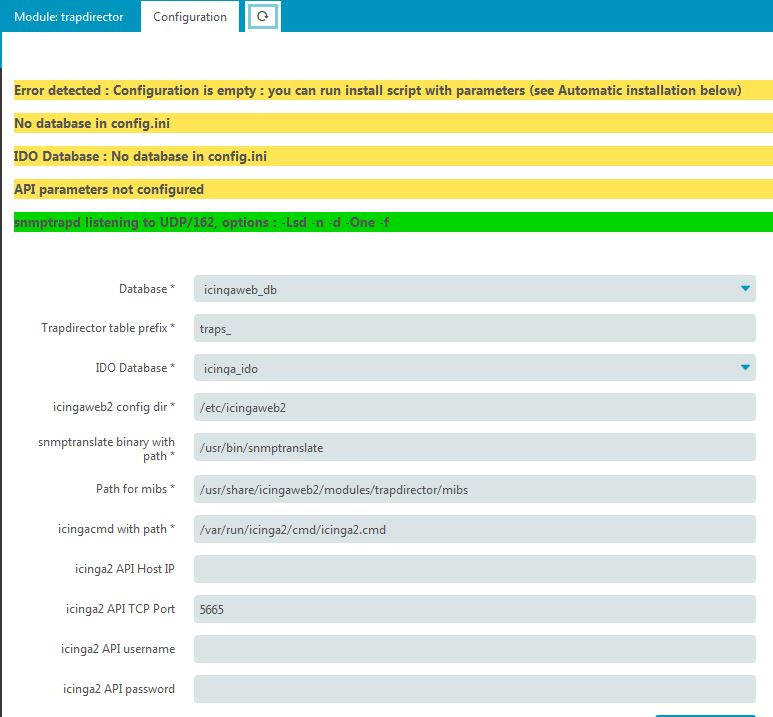

Installation
===============

Requirements
---------------

* `icingaweb2`
* `php7` or later
* `net-snmp` for `snmptrapd`
* `net-snmp-utils` for `snmptranslate`
* `MySQL/MariaDB` or `PostgreSQL` as DB backend 

Optional
---------------

* Icinga Director : for centralized service and template management.


Get installation files
---------------

1. Download latest release and unzip in a temporary directory.
2. Move the `trapdirector` directory to the modules directory (`/usr/share/icingaweb2/modules` by default).
3. `trapdirector/mibs/` directory must be writable by icinga web user for web GUI MIB upload to function.

Automatic installation
-----------------

There is an install script which can help you with creating backend database and users with proper permissions for it: 

Non standard IcingaWeb2 installation
------------------------------------

If IcingaWeb2 configuration directory is not `/etc/icingaweb2`, you must set it up manually in the `/trapdirector/bin/trap_in.php` file by modifying this string:
```
[....]
// Icinga etc path : need to change this on non standard icinga installation.
$icingaweb2_etc="/etc/icingaweb2";
[....]
```

Database Preparation
-----------------

* MySQL / MariaDB

Set up a new (or use existing) database (these commands should be run as root or database admin):

Create new database:

`mysql -u root -e "CREATE DATABASE <database name>;"`

Create user with required privileges:

```
mysql -u root -e "GRANT USAGE ON *.* TO <user>@localhost IDENTIFIED BY '<password>';"
mysql -u root -e "GRANT ALL PRIVILEGES ON <database name>.* TO <user>@localhost ;"
```

* PostgreSQL

Create user: 

````
su - postgres
createuser --interactive --pwprompt
````

or 

````
createuser -U <admin login> -W <new user> -P 
````

Create database: 

````
createdb -O <database user> <database name>
````

Create database in IcingaWeb2 web GUI on `/icingaweb2/config/resource` (trapdirector configuration page URL, available after module activation).


Module activation
---------------

Log in to IcingaWeb2 web GUI and activate trapdirector module in Configuration -> modules.

After that, configuration tab should look like this: 



The options are:

* Database : backend database of trapdirector.
* Prefix : the prefix for all trapdirector-related database tables.
* IDO Database : the IDO database of IcingaWeb2.
* icingaweb2 config dir : configuration directory of IcingaWeb2.
* snmptranslate binary : path to binary, can be tested in MIB&status page.
* Path for mibs : Directory for trapdirector local MIBs (default `/usr/share/icingaweb2/modules/trapdirector/mibs`). You can add directories with `:` separators. MIBs will then be uploaded in the first one listed. 
* icingacmd path : path to `icinga2` command file.
* API server/port/username/password : see the API section.

Schema creation
---------------

After setting the database (1) and IDO database (2), save the configuration: 


Click on (3) to create required database schema:


Then go back to module configuration, database check should be showing OK status:


API user setup
---------------

API user allows the module to use Icinga2 API to submit check results instead of command file or in case `icinga2` is installed on the server different from module.

To create an API user in `icinga2`, edit it's API users file (`/etc/icinga2/conf.d/api-users.conf` by default) and add a user or use existing one : 

```
object ApiUser "trapdirector" {
  password = "trapdirector"
  permissions = [ "status", "objects/query/Host", "objects/query/Service" , "actions/process-check-result" ]
}
```
Note: These permissions are sufficient as of now but may be subject to change (module will check for this, see below).

Reload `icinga2` with `systemctl reload icinga2` command.

Then configure API usage in the module starting with setting IP/hostname.


Fill following fields: 
* icinga2 host IP: IP or hostname of icinga2 server
* Port: Port of icinga2 API (5665 by default)
* API username: Name of the user in icinga2 `api_users.conf` file. 
* API password: Password of the API user.

Then, the module will test connection and report OK if everything is fine : 


Else it will show a relevant error (missing permission in the example) : 


Snmptrapd configuration
------------------------

Next, snmptrapd must be configured to relay all SNMP traps to the module.

Edit the `/etc/snmp/snmptrapd.conf` file and add this line to it (assuming default file locations): 

```
traphandle default /usr/bin/php /usr/share/icingaweb2/modules/trapdirector/bin/trap_in.php 
```

At the bottom of trapdirector configuration page, you will have list of PHP and module directories on your system. If it shows `php-fpm` instead of `php`, you are using PHP-FPM and need to replace `/sbin/php-fpm` path with something like `bin/php`.

Next, set up the community in `snmptrapd.conf` (`public` in example):

```
authCommunity log,execute,net public
```

Or, for SNMPv3 user :

```
createUser -e 0x8000000001020304 trapuser SHA "UserPassword" AES "EncryptionKey"
authUser log,execute,net trapuser 
```

So here is what your `snmptrapd.conf` should look like : 

```
authCommunity log,execute,net public
traphandle default /usr/bin/php /usr/share/icingaweb2/modules/trapdirector/bin/trap_in.php

createUser -e 0x8000000001020304 trapuser SHA "UserPassword" AES "EncryptionKey"
authUser log,execute,net trapuser 
```

Edit the launch options of snmptrapd
------------------------

* For RH7/CenOS7 and other systems using systemd : 

In `/usr/lib/systemd/system/snmptrapd.service` or `/lib/systemd/system/snmptrapd.service` 

If you have a line like `EnvironmentFile=-/etc/sysconfig/snmptrapd` change that file instead (as you would in RH6 example below).

If not, change `Environment=OPTIONS="-Lsd"` to `Environment=OPTIONS="-Lsd -n -t -Oen"`

If you have a weird 204 error on startup (happened on CentOS7 system), change `ExecStart` line instead to 

`ExecStart=/usr/sbin/snmptrapd -n -t -Oen $OPTIONS -f`


* For RH6/CenOS6 and other /etc/init.d system services 

In `/etc/sysconfig/snmptrapd` file change `# OPTIONS="-Lsd -p /var/run/snmptrapd.pid"` line to `OPTIONS="-Lsd -n -t -Oen -p /var/run/snmptrapd.pid"`

Enable & start snmptrap service : 
------------------------

* On systemd:

```
systemctl daemon-reload

systemctl enable snmptrapd

systemctl start snmptrapd
```

* on init.d systems:

```
chkconfig --level 345 snmptrapd on

service snmptrapd start
```

Now all traps received by the system will be redirected to the trapdirector module.

Set up MIBs
------------------------

The system MIBs should be set by `net-snmp` package. Test the default MIBs status by `snmptranslate 1.3.6.1.2.1.1.1` with a required result of `SNMPv2-MIB::sysDescr` 

Uploaded MIBs will be in `/usr/share/icingaweb2/modules/trapdirector/mibs` directory by default: you must check if the directory is writable by the user of the web server.
For example (as root) : 
```
chown apache:apache /usr/share/icingaweb2/modules/trapdirector/mibs
chmod 755 /usr/share/icingaweb2/modules/trapdirector/mibs
```

After this, you can add first MIBs into MIB database with the `icingacli trapdirector mib update` command

Ready to go!

Continue to the [user guide](02-userguide.md) for configuring trap handlers and other trapdirector features.
