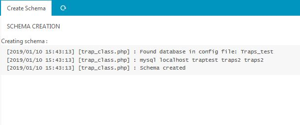
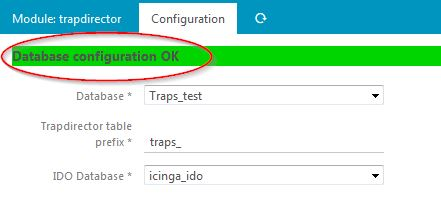

Installation
===============

Requirements
---------------

* Icingaweb2 and php7
* net-snmp for snmptrapd
* net-snmp-utils for snmptranslate
* mysql/mariadb database

Better with
---------------

* Director : to set up services, templates (not implement right now).


Install files
---------------

1. Download latest release and unzip in a temporary directory.
2. Move the 'trapdirector' directory to the /usr/share/icingaweb2/modules directory
3. trapdirector/mibs/ must be writable by icinga web user to upload mibs from web GUI

Activate module
---------------

Log in to icingaweb2 go to Configuration -> modules  and activate the trapdirector modules

Go to the configuration tab, it should look like this : 


Set up a new (or use existing) database in icingaweb 2 (see installation instructions at the bottom of the Configuration page)

The options are

* Database : the DB where traps will be stored
* Prefix : the prefix for all database tables
* IDO Database : the IDO database set up with IcingaWeb2
* Icingaweb2 config dir : configuration directory in case of uncommon installation of icingaweb2
* snmptranslate binary : default should be OK
* Path for mibs : must include net-snmp standard mibs (in /usr/share/snmp/mibs by default) and local mibs (in /usr/share/icingaweb2/modules/trapdirector/mibs)
The value by default should be OK)
* icingacmd path : default should be OK

Create schema
---------------

After setting the database (1) and ido database (2), refresh the config page : 


Click on (3) to create schema



Then go back to module configuration, database should be OK :



Snmptrapd configuration
------------------------

Now, you must tell snmptrapd to send all traps to the module.

Edit the /etc/snmp/snmptrapd file and add : 

```
traphandle default /opt/rh/rh-php71/root/usr/bin/php /usr/share/icingaweb2/modules/trapdirector/bin/trap_in.php 
```

Note : on bottom of configuration page, you will have the php and module directories adapted to your system. If it shows 'php-fpm' instead of php, you are using php-fpm and need to replace /sbin/php-fpm with something like bin/php .

In any case, it must be the php binary of php version > 7. You can check version on command line doing `php -v` 


Set up the community (still in snmptrapd.conf) : here with "public" 

```
authCommunity log,execute,net public
```

With a v3 user :

```
createUser -e 0x8000000001020304 trapuser SHA "UserPassword" AES "EncryptionKey"
authUser log,execute,net trapuser 
```

So here is what your snmptrapd.conf should look like : 

```
authCommunity log,execute,net public
traphandle default /opt/rh/rh-php71/root/usr/bin/php /usr/share/icingaweb2/modules/trapdirector/bin/trap_in.php

createUser -e 0x8000000001020304 trapuser SHA "UserPassword" AES "EncryptionKey"
authUser log,execute,net trapuser 
```

Edit the launch options of snmptrapd
------------------------

TODO : see why the bug with OPTION is here

* For RH7/CenOS7 and other systems using systemd : 

In : `/usr/lib/systemd/system/snmptrapd.service`

Change : `Environment=OPTIONS="-Lsd"`

To : `Environment=OPTIONS="-Lsd -n -t -On"`

Note : if you have a weird 204 error on startup (happened on one centOS7 system), change ExecStart instead : 

`ExecStart=/usr/sbin/snmptrapd -n -t -On $OPTIONS -f`

* For RH6/CenOS6 and other /etc/init.d system services 

In : `/etc/sysconfig/snmptrapd`

Change : `# OPTIONS="-Lsd -p /var/run/snmptrapd.pid"`

To : `OPTIONS="-Lsd -n -t -On -p /var/run/snmptrapd.pid"`

Enable & start snmptrad service : 
------------------------
```
systemctl enable snmptrapd

systemctl start snmptrapd
```

Now all traps received by the system will be redirected to the trapdirector module.

Set up mibs : 
------------------------

The system mibs should be in `/usr/share/net-snmp/mibs` directory : change the path in configuration if needed.

Mib you can upload will be in (default) `/usr/share/icingaweb2/module/trapdirector/mibs` : you must check the directory is writable by the user of the web server.
For example (as root) : 
```
chown apache:apache /usr/share/icingaweb2/module/trapdirector/mibs
chmod 755 /usr/share/icingaweb2/module/trapdirector/mibs
```

After this, you can create the first mib database (from system traps) with the following command line : 

```
<your php binary> /usr/share/icingaweb2/modules/trapdirector/bin/create_mib_db.php
```

Ready to go !

Now have a look at the doc : 
 
