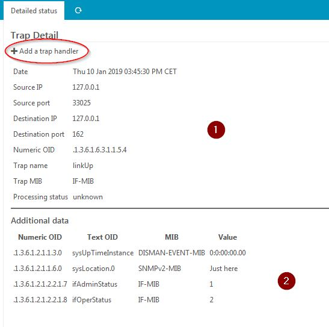
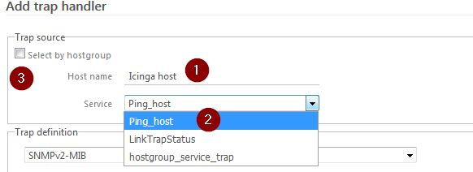

Traps
===============

NOTE NOTE NOTE NOTE : PROJECT UNDER DEV : SOME SCREEN CAPTURES CAN CHANGE A LOT AND FINAL DOC WILL BE MORE DETAILED !

A little about traps
---------------

TODO.

Have a look here : http://www.net-snmp.org/wiki/

Sending traps for testing
---------------

In the bin directory you have 3 bash files test_trap_v(1|2|3).sh which will send snmp v1, v2 & v3 traps to localhost.

Looking at traps received
---------------

Go to traps -> received to have a list of received traps

Click on a trap to have details

Columns : 
* Time the trap was received
* Source IP of trap
* Trap OID (or name if it could be resolved)
* Status : 

unknown : no rule was found for this trap

done : rule was found and evaluated

error : ...

waiting : trap was received, but no rule was applied for now

Trap details
---------------

Here you have all the information about the trap received :
* 1 : global information
* 2 : objects sent with trap and their values
* 3 : add a rule based on this trap

Click on 'add rule' : 

Adding a rule based on a received trap
---------------
	
The form is divided in three parts

1) host/service and Trap : 

* 1 : Icinga host whose service will be updated
* 2 : Service of host wich sttus will be updated. It must accept passive checks and active checks disabled (TODO : show template)
* 3 : MIB / trap name to select trap from (auto filled as trap has been recognised)
* 4 : trap OID
* 5 : if active, this button will add ALL objects that can be set with this trap (as descripbed in it's MIB) in the objects definition below.

2) Trap objects

This part lists all objects that will be used in the display and rules as $N.

As you selected a trap, the objects sent with the trap are automaticaly added in here

* 1 : enter OID here to manually add bojects
* 2 : Shortcuts $N that will be used in rules
* 3 : Value sent by the trap selected earlier
* 4 : Type of trap as described in MIB

3) Display and rules

There you will configure : 
* The message displayed in the service when trap is received (and rule passes)
* The rule for actions, i.e. set service state

* 1 : Display

The display string will be sent with status to service. You can use all the $N defined above.

Here, the display will be for example : "Trap linkUP received for 3"
(if interface index in object is 3).

* 2 : Rule

Here you define a rule. Actions if rule matches is defined below.

Here the rule "( $5 = 3 ) & ( $3 = 2) " means : 

If 'ifIndex' is 3 AND ifAdminStatus is 2 THEN rule matches

Rule accepts numbers and strings with these operators : < <= > >= = !=

You can group with parenthesis and logical operators are : | &

To test existence of object, do : ($3)

space are ignored and comparison operators are evaluated before logical ones.

Examples : 

$5 = 3  &  $3 = 2 : works, same as the example

$5 = 3  &  $3 = 2 | $4 = 1 : works like : ($5 = 3  &  $3 = 2) | $4 = 1 . Better with parenthesis !

($5 = "eth0") & ( $3 = 2) : works as expected

($5 = "eth0") < $3 : ERROR

* 3 : actions depending on rule matches or not. You can choose any common status or 'nothing' to do nothing'

Then click on save to save and activate your rule for next trap.

Updating a rule
---------------

On the Handler page, click on a rule to edit it.

Testing a rule
---------------
TODO

CURRENT DOC END..... come back in some days

