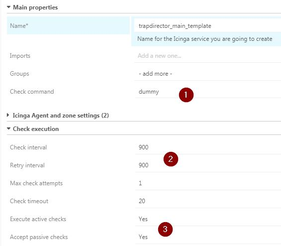

Mib & Status
===============

In the "Status & Mibs" menu you will set all the configuration for mibs and database rules.

Status
===============

Database
---------------

Traps are held in the database, to get rid of old ones, you can set here the number of days the traps are kept.

This will occur at regular interval (not implemented in beta) or when a trap is received.

To drop some traps immediatly, you can change the number of days and click "Drop it now".

Log destination
---------------

Here is where the trap receiver 

The easy way to create rule is with an existing trap, but you also can create a rule before receiving any traps.

Mib Management
===============

Mib Database and management
---------------

The database should hold the snmp traps definition and their objects so you can select them easily when creating a rule.

On bottom of the page, you can upload a mib file (or put it in the mibs/ directory of module).

The system then needs to scan all mib files , so it takes some time. You can update here or on cli : 

`icingacli trapdirector mib update` : with this you will have a display of what's going on.

If you launch update here, the process will run in background (you can leave the page), and the button will be disabled until process has finished.

snmptranslate
---------------

The system needs snmptranslate to parse the mibs : here you can check if the configuration of the module is correct, and if snmptranslate works fine on your system.

Services & template management
===============

Not much here for now : you can create a service template for services using traps.

Here is some details about it : 

1 : the active check is "dummy" which will return OK all the time

2 : check & retry retry interval is the time your trap will be reverted to "OK", here is how it's working : 

- at 08h00 the active check runs and gives "OK". Next check is in 900s (15 min) so at 08h15
- at 08h10 a trap give a "critical" status to the service. Next check is set to 08h10 + 15 min = 08h25.
- at 08h25 if no traps have been received, the active check runs and returns OK.

3 : Need to acept active & passive checks.

back to user guide : 