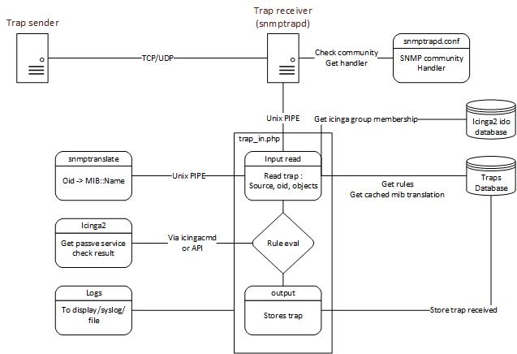

Receiver Logic
===============


General diagram
---------------




Network trap 
---------------

When a trap is received by snmptrapd, it will 

1. Check the SNMP community string, or v3 user/password. snmptrapd will drop traps with the wrong authentication.
2. Send to the defined handler as input :

```
UDP: [127.0.0.1]:33025->[127.0.0.1]:162
.1.3.6.1.2.1.1.3.0 0:0:00:00.00
.1.3.6.1.6.3.1.1.4.1.0 .1.3.6.1.6.3.1.1.5.4
.1.3.6.1.2.1.1.6.0 Just here
.1.3.6.1.2.1.2.2.1.7 1
.1.3.6.1.2.1.2.2.1.8 1
```
Here, the trap is sent over UDP from localhost to localhost. The following lines are trap objects, including the trap OID.

Translated, this trap means : 

```
sysUpTimeInstance	0:0:00:00.00
snmpTrapOID.0		IF-MIB::linkUp
sysLocation.0		Just here
ifAdminStatus		up(1)
ifOperStatus		up(1)
```

trap_in.php
---------------

1) Reads the trap from stdin

Extracts trap oid and stores objects (OID/value)

2) Gets all rules which match ( sourceIP / trapoid )

Evaluate all rules one by one.
If a rule is empty, it will always be true. i.e. the "on match" action will by executed.

If the action is other than 'do nothing' or 'ignore', then it sends a passive service check, either via:

* the icingacmd file
example : "[1547221876] PROCESS_SERVICE_CHECK_RESULT;Icinga host;LinkTrapStatus;2;Trap linkUp received at 0:0:00:00.00 from Just here" > /var/run/icinga2/cmd/icinga2.cmd

* or the icinga2 API

3) Stores the trap along with its status (except if the action is 'ignore')
- done : rule was found , whether or not it matches or action has been made
- unknown : no sourceIP/OID rule was found
- error : ....
- waiting : a trap was received, but rules were not searched/evaluated (for future use with distributed environments)


Go back to the [user guide](02-userguide.md).
