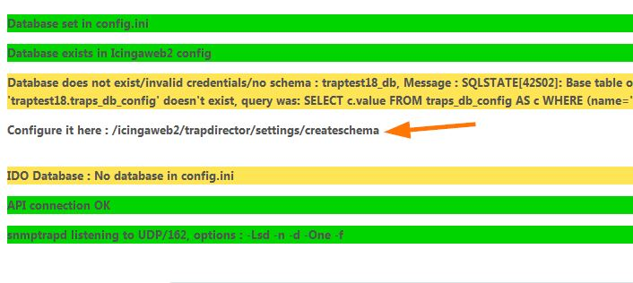

Automatic Installation
===============

Requirements
---------------

* You must have root access on the Icinga server
* Icinga, IcingaWeb2, trap receiver (snmptrapd) must be on the server
* mysql database only for now, but can be on remote server
* Server with systemctl (CentOS and RH 7 ...)


What will it setup for you
---------------

* Database creation & database user
* API setup and user creation
* snmptrapd.conf configuration
* snmptrapd starting configuration
* Set file permissions
* Setup paths or icingaweb2 config directory and module directory

It's safe
---------------

You can run it even with everything configure, it will always ask before doing anything.

After enabling module
---------------

Go to configuration tab, you should see this error : 


Now have a look after the configuration form, there is the full command line you need to enter : 


Enter this a a super user (like root) :

```
[root@icinga trapdirector]# /usr/share/icingaweb2/modules/trapdirector/bin/installer.sh -c all -d /usr/share/icingaweb2/modules/trapdirector -p /opt/rh/rh-php71/root/usr/sbin/php-fpm -a apache -w /etc/icingaweb2

```

First API check and you can setup a new user : 

```
==================================
API Check
icinga2 binary & path(/etc/icinga2) , api : enabled
api users found :
root
trapdirector

Add a user [y/N]y
Username : trap1
Password : trap1
Reload icinga (need systemctl) [y/N]y
Adding API user in trapdirector configuration

```

Next snmptrapd configuration

```
==================================
Snmptrapd config check

Using file : /etc/snmp/snmptrapd.conf
Searching for traphandles in /etc/snmp/snmptrapd.conf
/opt/rh/rh-php71/root/bin/php /usr/share/icingaweb2/modules/trapdirector/bin/trap_in.php

Add a traphandle [y/N]y
Added traphandle to /opt/rh/rh-php71/root/usr/sbin/php-fpm /usr/share/icingaweb2/modules/trapdirector/bin/trap_in.php in /etc/snmp/snmptrapd.conf
Searching for community in /etc/snmp/snmptrapd.conf
log,execute,net public

Add a v1/v2c community [y/N]y

Enter community : private
Restart snmptrapd (need systemctl) [y/N]y

==================================
Snmptrapd starting options

Found process snmptrapd with pid 21987
Snmptrapd options are :  -Lsd -n -d -One -f
```

You can add a schema and the corresponding user

```
==================================
Adding trap schema in database

Script needs a user which can create schema, user, and assign permissions

Enter database host [set to 127.0.0.1 if you don't enter anything] :
Enter database port [3306] :
Enter username : root
Enter password (or press enter if no password is required) :
Connecting...params OK
Enter new database name (or enter to exit): traptest18
Enter database user for db traptest18 (or enter to exit):traptest18user
Enter database new password for traptest18user [] :traptest18pass
Allow new user to connect only from [localhost] :
Adding :  grant usage on *.* to 'traptest18user'@'localhost' identified by 'traptest18pass'
Adding :  grant all privileges on traptest18.* to 'traptest18user'@'localhost';
Database parameters set

Do you want to add this database as a resource in IcingaWeb2 [y/N]y
Added traptest18_db as icinga resource !
Adding this to module configuration
Done !
```

Finally : setup permissions and paths.

```
==================================
File permissions setup

Using module directory : /usr/share/icingaweb2/modules/trapdirector
Using web server user : apache

Done setting permissions

==================================
[root@icinga trapdirector]#
```

Back to Icingaweb2 GUI
---------------

Reload the configuration page, it should now complain about the schema : 



So click on create schema : 


Back to settings page : SAVE the configuration.

If there is no more errors, you are ready to go !

Now have a look at the doc : 
 
