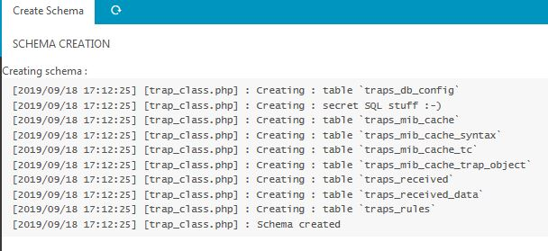

Automatic Installation
===============

Requirements
---------------

* You must have root access on the Icinga server
* Icinga2, Icingaweb2, trap receiver (snmptrapd) must be on the server
* MySQL or PostgreSQL database - can be on a remote server
* Server with systemctl (CentOS and RH 7 or newer ...)


What will it setup for you
---------------

* Database creation & database user
* API setup and user creation
* snmptrapd.conf configuration
* snmptrapd starting configuration
* Set file permissions
* Setup paths or icingaweb2 config directory and module directory

It's safe
---------------

You can run it even with everything already configured. It will always ask before doing anything.

Launching the installer
---------------

1. After enabling the trapdirector module via Icingaweb2 -> Configuration -> Modules -> trapdirector, go to the configuration tab. You should see this error: 


1. Click "Save Config" to save default parameters the configuration tab has discovered (IDO database, snmptranslate, etc.)

1. To launch the installer, scroll down to "Automatic installation" and copy the command into a terminal (as root user).

Note:
- If you use PostgreSQL, add "-b pgsql" to the end to the command.
- If the command contains PHP BINARY NOT FOUND, amend the command with the full path to your php interpreter.

Example install command:
```
/usr/share/icingaweb2/modules/trapdirector/bin/installer.sh -c all -d /usr/share/icingaweb2/modules/trapdirector -p /usr/bin/php -a apache -w /etc/icingaweb2
```

Installer
---------------

First the installer checks the Icinga2 API, and lets you add a new API user for trapdirector: 

```
==================================
API Check
icinga2 binary & path(/etc/icinga2) , api : enabled
api users found :
root
trapdirector

Add a user [y/N]y
Username : trap1
Password : trap1
Reload icinga (need systemctl) [y/N]y
Adding API user in trapdirector configuration

```

Next, it performs snmptrapd configuration:

```
==================================
Snmptrapd config check

Using file : /etc/snmp/snmptrapd.conf
Searching for traphandles in /etc/snmp/snmptrapd.conf
/opt/rh/rh-php71/root/bin/php /usr/share/icingaweb2/modules/trapdirector/bin/trap_in.php

Add a traphandle [y/N]y
Added traphandle to /opt/rh/rh-php71/root/usr/sbin/php-fpm /usr/share/icingaweb2/modules/trapdirector/bin/trap_in.php in /etc/snmp/snmptrapd.conf
Searching for community in /etc/snmp/snmptrapd.conf
log,execute,net public

Add a v1/v2c community [y/N]y

Enter community : private
Restart snmptrapd (need systemctl) [y/N]y

==================================
Snmptrapd starting options

Found process snmptrapd with pid 21987
Snmptrapd options are :  -Lsd -n -d -One -f
```

Then it sets up your database schema and user:

```
==================================
Adding trap schema in database

Script needs a user which can create schema, user, and assign permissions

Enter database host [set to 127.0.0.1 if you don't enter anything] :
Enter database port [3306] :
Enter username : root
Enter password (or press enter if no password is required) :
Connecting...params OK
Enter new database name (or enter to exit): traptest18
Enter database user for db traptest18 (or enter to exit):traptest18user
Enter database new password for traptest18user [] :traptest18pass
Allow new user to connect only from [localhost] :
Adding :  grant usage on *.* to 'traptest18user'@'localhost' identified by 'traptest18pass'
Adding :  grant all privileges on traptest18.* to 'traptest18user'@'localhost';
Database parameters set

Do you want to add this database as a resource in IcingaWeb2 [y/N]y
Added traptest18_db as icinga resource !
Adding this to module configuration
Done !
```

Finally, it sets up relevant filesystem permissions:

```
==================================
File permissions setup

Using module directory : /usr/share/icingaweb2/modules/trapdirector
Using web server user : apache

Done setting permissions

==================================
[root@icinga trapdirector]#
```

Back to Icingaweb2 GUI
---------------

1. Reload the configuration tab (do NOT yet click "save changes" as it will overwrite what the script has done). It should now complain about the database schema: 


1. Click on the "Create Schema" link half way down the page. You will be taken to the Create Schema tab: 


1. Click "Return to settings page", and SAVE the configuration (for IDO database).

If there are no more errors, you are ready to go!


User Guide
------------------------
Continue to the [user guide](02-userguide.md) for configuring trap handlers and other trapdirector features.
